# MONET：面向移动端大模型推理的结构化分解与部署优化方案

## 1. 背景与目标

随着大语言模型和多模态大模型的发展，模型规模和推理成本持续上升。相比服务器端，移动端设备受到内存容量、访存带宽、计算资源、功耗以及后端 kernel 支持能力的限制，因此直接部署大模型往往面临较大的性能瓶颈。

在移动端部署 LLM/VLM 时，常见优化路线包括量化、稀疏化和张量分解。其中，量化可以显著降低权重存储和访存开销，但继续降低比特宽度通常会带来明显精度损失；传统稀疏方法虽然理论上可以减少计算量，但在移动端往往缺乏高效 kernel 支撑，难以将理论 FLOPs 收益转化为实际 latency 收益；而以 SVD 为代表的低秩分解方法虽然可以降低矩阵乘法复杂度，但其计算路径、rank 选择和中间张量读写都不够适合移动端部署。

因此，本方案的核心目标是：在保证模型精度可接受的前提下，通过结构化矩阵分解、数据流优化和移动端部署适配，实现大模型在手机端的实际推理加速。

---

## 2. 早期方案：面向 MoE/VLM 的二值化与子空间分解

### 2.1 初始压缩对象

早期实验主要针对 Qwen3-VL-Instruct 系列模型，包括：

* Qwen3-VL-2B
* Qwen3-VL-4B

在多模态模型中，初始方案主要压缩 Transformer/MoE 部分，而暂时不处理 vision encoder。测试数据集包括：

* MMMU：多模态综合评估数据集；
* BLINK：多图选择与跨任务 VLM benchmark；
* MVBench：视频视觉推理与感知能力评估基准。

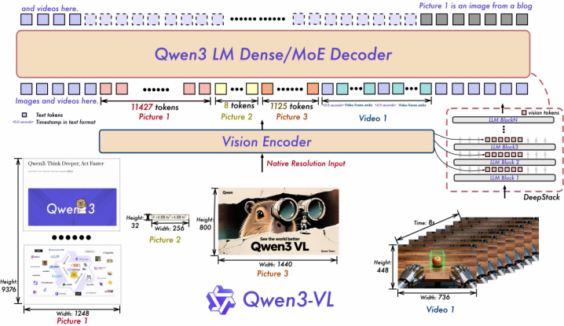
**图1 Qwen3-VL 模型结构图，当前仅压缩 Transformer/MoE 部分。**

### 2.2 初始方法组成

早期方案由三个核心模块构成：

1. **Cross-Expert Subspace Decomposition, CESD**
   通过跨专家子空间分解，提取不同专家之间共享的主子空间，从而减少重复表示。

2. **Global Loss-Aligned Saliency, GLAS**
   通过全局 loss 对齐的重要性评估，判断哪些方向、列或 block 对模型输出更敏感，从而决定保留精度。

3. **Null-Space Guided Expert-Shift Suppression, NGES**
   通过零空间约束抑制二值化或低比特化后带来的 expert shift，降低路由结果偏移带来的精度损失。

整体思路是：利用专家或层之间的冗余结构，将高重要性部分保留更高精度，将低重要性部分压缩到极低比特，并通过子空间和零空间约束维持模型行为稳定。


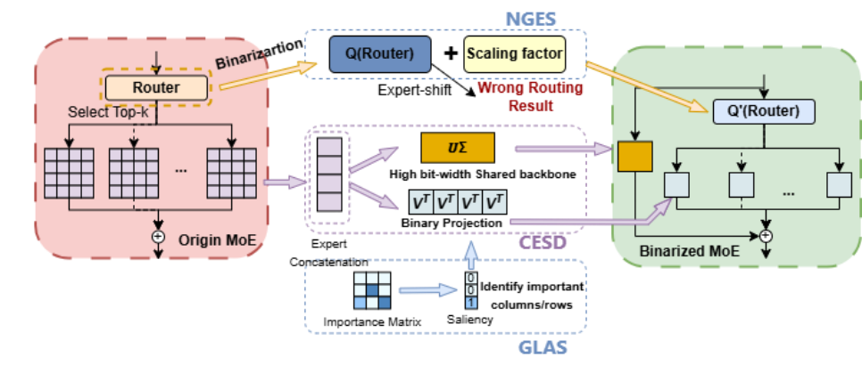
**图2 CESD + GLAS + NGES 总体框架图**

### 2.3 初始实验结果与问题

在 Qwen3-VL-2B 上，原始模型在 MMMU、BLINK、MVBench 上分别约为 53.0、51.4、60.8；初始单聚合低比特方案约为 49.4、48.5、59.2。

在 Qwen3-VL-4B 上，原始模型分别约为 67.1、62.5、68.1；初始单聚合方案约为 61.5、56.4、67.5。

可以看到，视频任务 MVBench 的性能相对保持较好，但 MMMU 和 BLINK 上存在一定精度下降。这说明单一聚合方式能够压缩模型，但对于不同层、不同 block 的差异性建模不足。

---

## 3. 从单聚合到 Layer-wise / Block-wise 聚合

### 3.1 层间相似度分析

为进一步缩小低比特模型与原始模型的性能差距，方案首先对不同层之间的相似性进行分析。尝试过的指标包括：

* Frobenius 相似度；
* 核范数对齐程度；
* 奇异向量重叠度等。

经过比较后，方案选择 **Frobenius 相似度** 作为主要指标，用于判断不同层之间是否可以共享聚合策略。

其基本形式为：

```math
\cos(W_i, W_j) =
\frac{\langle W_i, W_j \rangle}
{\|W_i\|_F \|W_j\|_F}
```

实验中分别观察了 text-layer、vision-layer 以及整体模型的相似度热力图。结果显示，不同层之间确实存在一定结构差异，因此需要更细粒度的划分，而不能简单采用全局统一聚合策略。

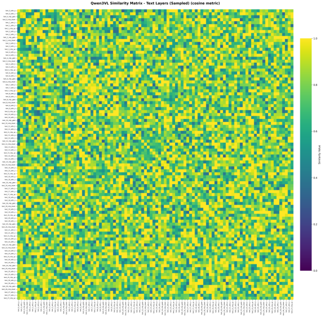 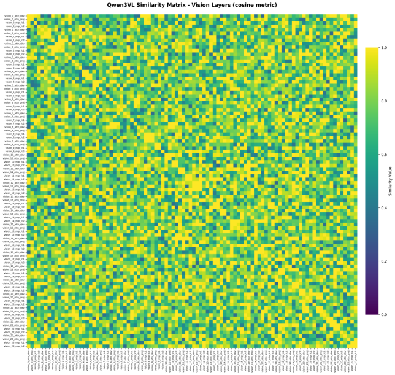 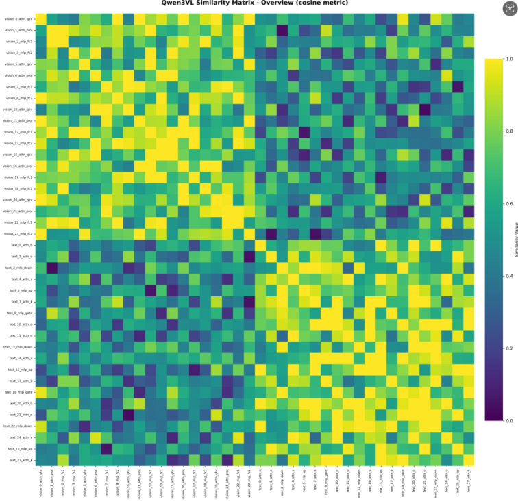

**图3 Qwen3-VL 不同层之间的 Frobenius 相似度热力图，分别为 text-layer、vision-layer 和整体模型三类。**

### 3.2 Layer-wise 聚合

在单聚合方案的基础上，进一步引入 layer-wise 聚合，即根据不同层的相似度和重要性，为不同层设置不同的聚合或压缩策略。

实验结果显示，layer-wise 聚合相比单聚合有明显恢复。例如：

| Model       |        Method | MMMU | BLINK |
| ----------- | ------------: | ---: | ----: |
| Qwen3-VL-2B |        Origin | 53.0 |  51.4 |
| Qwen3-VL-2B |      Ours 单聚合 | 49.4 |  48.5 |
| Qwen3-VL-2B | Layer-wise 聚合 | 51.2 |  49.2 |
| Qwen3-VL-4B |        Origin | 67.1 |  62.5 |
| Qwen3-VL-4B |      Ours 单聚合 | 61.5 |  56.4 |
| Qwen3-VL-4B | Layer-wise 聚合 | 63.2 |  58.5 |

这说明层级差异对压缩精度具有重要影响，简单的全局策略会低估部分关键层的敏感性。

### 3.3 Block-wise 聚合

进一步地，将一个 tensor 按 row-wise 划分为多个 block：

```math
W =
\begin{bmatrix}
W^{(1)} \\
W^{(2)} \\
\cdots \\
W^{(B)}
\end{bmatrix}
```

对于每个 block，使用不同的子空间分解和重要性评估：

```math
W^{(b)} \approx U_s^{(b)} \Sigma_s^{(b)} V_s^{(b)T} + \Delta^{(b)}
```

由于不同 block 的重要性和可压缩性不同，其 rank 或 bit-width 不应完全一致。因此，GLAS 从原先的 tensor-level / layer-level 重要性评估，进一步扩展为 block-level saliency 评估：

```math
S^{(b)} = \mathbb{E}_x
\left\|
\frac{\partial \mathcal{L}}{\partial W^{(b)}}
\right\|
```

对应策略为：

* 高 saliency block：保留更多主子空间，使用更高 bit-width；
* 低 saliency block：采用更激进的二值化或 1-bit 表示，并依赖 NGES 稳定推理。

实验结果显示，block-wise 聚合进一步提升性能。例如：

| Model       |        Method | MMMU | BLINK |
| ----------- | ------------: | ---: | ----: |
| Qwen3-VL-2B |        Origin | 53.0 |  51.4 |
| Qwen3-VL-2B |      Ours 单聚合 | 49.4 |  48.5 |
| Qwen3-VL-2B | Layer-wise 聚合 | 51.2 |  49.2 |
| Qwen3-VL-2B | Block-wise 聚合 | 51.8 |  49.5 |
| Qwen3-VL-4B |        Origin | 67.1 |  62.5 |
| Qwen3-VL-4B |      Ours 单聚合 | 61.5 |  56.4 |
| Qwen3-VL-4B | Layer-wise 聚合 | 63.2 |  58.5 |
| Qwen3-VL-4B | Block-wise 聚合 | 64.1 |  59.0 |

---

## 4. 手机端部署遇到的问题：SVD 路线的不适配

### 4.1 初步移动端测试

为了验证方案能否落地到移动端，早期测试使用了 llama.cpp 和 T-MAC。

llama.cpp 侧可以通过 GGUF 模型直接运行，例如：

```bash
./build/bin/llama-cli \
  -m ~/LLM_model/llama-2-7b-eqat-w2g128-gptq.gguf \
  -c 32 \
  -p "Hello"
```

T-MAC 侧可以使用已有 pipeline 进行 Android 编译和部署，例如：

```bash
python tools/run_pipeline.py \
  -o ~/Downloads/test_models/llama-2-7b-eqat-w2g128-gptq \
  -m llama-2-7b-2bit \
  -d android \
  -ndk $NDK_HOME \
  -u
```

但是，当尝试将本方案生成的极低比特模型直接转换并部署到 llama.cpp/T-MAC 时，会出现不适配问题。核心原因在于：原有方案依赖 SVD 分解和低秩计算，而移动端推理框架并没有天然支持这种低秩计算路径。

### 4.2 SVD 在移动端的问题

SVD 分解形式为：

```math
A \approx U \Sigma V
```

或在低秩近似中保留前 r 个主成分：

```math
W \approx U_r \Sigma_r V_r^T
```

理论上，SVD 可以将一次 dense matmul 转化为两次较小矩阵乘法：

```math
y = W x \approx U_r (\Sigma_r V_r^T x)
```

其计算量约为：

```math
cost_{SVD} \approx r(m+n)
```

当 rank 很小时，SVD 理论上可以带来显著计算下降。但在移动端实际部署时，SVD 存在三个问题：

1. **rank 选择困难**
   不同层的低秩性差异很大，rank 太低会造成明显精度损失，rank 太高则计算收益不足。

2. **计算路径不规则**
   SVD 分解后会产生多个矩阵乘法，且矩阵形状取决于 rank，难以提前固定 kernel 和执行路径。

3. **中间张量读写增加**
   移动端本身访存带宽受限，SVD 引入的中间结果会进一步增加 DRAM read/write，抵消理论 FLOPs 收益。

因此，虽然 SVD 在算法层面是自然的矩阵压缩思路，但它并不是一个适合移动端工程落地的结构。

---

## 5. 从 SVD 转向 Monarch：结构化、规则化、移动端友好的分解

### 5.1 Monarch 矩阵基本形式

为解决 SVD 在移动端部署中的不规则问题，方案转向 Monarch 矩阵分解。

对于一个 (n x n) 矩阵，当 (n = m^2) 时，Monarch 矩阵可以写成：

```math
M = P L P R
```

其中：

* (P)：固定置换矩阵；
* (L, R)：分块对角矩阵；
* (P) 本质上执行 reshape-transpose-reshape 的 index shuffle；
* (L, R) 中大量元素为零，因此整体具有结构化稀疏性。

由于 (P) 是固定的，实际可训练或可存储的参数主要来自 (L) 和 (R) 的非零块。对于 (n = m^2)，Monarch 的自由参数规模约为：

```math
2m^3 = 2n^{1.5}
```

因此，Monarch 的目标是将原本 (O(n^2)) 的 dense 计算，转化为更规则的次二次复杂度结构计算。

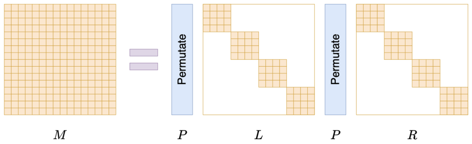
**图4 Monarch M = PLPR 的结构图**

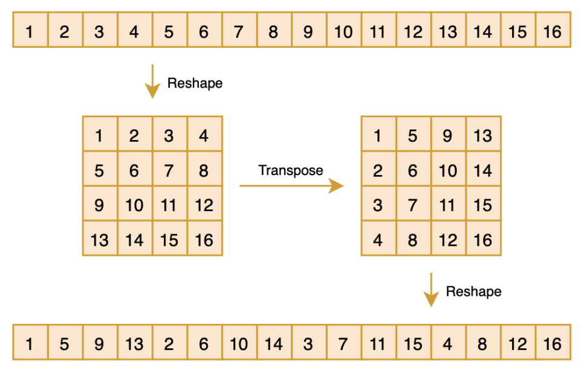
**图5 Monarch reshape-transpose-reshape permutation 示意图**


### 5.2 Monarch 相比 SVD 的优势

与 SVD 相比，Monarch 更适合移动端部署，原因包括：

1. **结构固定**
   Monarch 使用固定 block size 和固定 permutation，执行路径更稳定，不依赖动态 rank。

2. **硬件映射友好**
   分块对角矩阵可以映射到固定粒度的 block matmul，更容易适配移动端 CPU/NPU kernel。

3. **访存局部性更好**
   block diagonal 结构天然具有局部性，更适合移动端 cache 和 shared memory。

4. **中间张量更少**
   相比 SVD 的多级低秩计算，Monarch 可以通过 layout 和数据流优化减少显式中间张量。

5. **更适合非低秩层**
   SVD 的收益依赖矩阵是否能被低 rank 近似，而 LLM 权重往往存在长尾分布和 outlier。Monarch 不强依赖低秩性，而是利用结构化稀疏和 block 规则性，因此在非低秩层上更有潜力。

### 5.3 初步算法效果

在早期测试中，SVD 与 Monarch 的重构误差比较为：

| Method  |    MSE |
| ------- | -----: |
| SVD     | 0.1584 |
| Monarch | 0.1452 |

在 Qwen3-VL-2B 上，Monarch 相比 SVD 在精度上也有恢复：

| Method       | MMMU | Avg bit | BLINK | Avg bit |
| ------------ | ---: | ------: | ----: | ------: |
| Origin       | 53.0 |  16-bit |  51.4 |  16-bit |
| Ours-SVD     | 49.4 |    1.62 |  48.5 |    1.65 |
| Ours-Monarch | 51.3 |    3.01 |  50.8 |    3.00 |

这说明 Monarch 虽然平均 bit 数略高，但在模型性能保持和移动端适配方面更有潜力。

---

## 6. 完整方案：Arch-aware Monarch + FlashMonarch + Block Sparse

最终方案可以概括为三个层次：

1. 架构感知的 Monarch 分解；
2. FlashMonarch 数据流优化；
3. 硬件感知的块稀疏机制。

### 6.1 架构感知的 Monarch 分解

对于 Transformer 中的 Attention 和 FFN 层，核心计算为：

```math
y = W x
```

原始 dense 计算复杂度为：

```math
O(n^2)
```

通过 Monarch 结构，将权重表示为：

```math
W \approx P_L B_1 P B_2 P_R
```

其中：

* (P_L, P_R, P)：置换矩阵；
* (B_1, B_2)：block diagonal 矩阵；
* block size 是关键超参数，会影响精度、访存和计算效率。

在实验中，考虑到 4096 = 64 × 64 或 32 × 128 等常见 LLM 维度，重点测试了不同 block size 的效果。

| Block size     |   16 |   32 |   64 |  128 |
| -------------- | ---: | ---: | ---: | ---: |
| Decode token/s | 6.64 | 7.09 | 7.38 | 6.85 |
| PPL drop       | 0.23 | 0.31 | 0.36 | 0.73 |

可以看到，block size 过小会影响执行效率，block size 过大又会增加精度损失。因此，方案需要构建 accuracy-latency trade-off profiling，根据不同模型、层和设备自动选择合适 block size。


### 6.2 FlashMonarch：面向访存瓶颈的数据流优化

标准 Monarch 计算包含显式 permutation：

```math
M = P_L L P_R R
```

推理时需要执行：

```math
y = x P_L L P_R R
```

显式 permutation 会带来额外内存访问和 kernel 启动开销。考虑到 permutation 本质上是 index shuffle，可以通过数学变换和 layout 设计将其融合进 block 访问过程。

方案将原始执行顺序：

```text
permutation -> block matmul -> permutation -> block matmul
```

重排为：

```text
block matmul -> permutation -> block matmul -> permutation
```

进一步地，通过提前调整 block layout，将 permutation 隐式融合进数据访问索引，使其不再作为独立 kernel 执行。

这种设计受到 FlashAttention 的启发：不是简单减少算术操作，而是通过 tile/block 级数据复用，减少中间数据搬运和重复访存，从而更好地适配移动端 bandwidth-bound 的执行特点。

### 6.3 硬件感知的块稀疏机制

Monarch 分解后，不同 block 对最终输出的贡献并不相同。因此，可以进一步评估 block 重要性，并删除低重要性 block，从而减少计算量。

对于 block size = 32 的实验：

| Block 数量 |    128 |    120 |    112 |     96 |     64 |
| -------- | -----: | -----: | -----: | -----: | -----: |
| PPL drop |   0.23 |   0.25 |   0.26 |   0.59 |   3.85 |
| Time/ms  | 960.21 | 927.42 | 867.81 | 771.23 | 574.98 |
| Speedup  |      - | 1.035× | 1.106× | 1.245× | 1.670× |

对于 block size = 64 的实验：

| Block 数量 |     64 |     56 |     48 |     40 |     32 |
| -------- | -----: | -----: | -----: | -----: | -----: |
| PPL drop |   0.28 |   0.32 |   0.45 |   1.12 |   4.60 |
| Time/ms  | 905.13 | 820.74 | 710.55 | 545.62 | 483.52 |
| Speedup  |      - | 1.103× | 1.274× | 1.659× | 1.872× |

该机制可以通过 bitmap 表示被保留的 block，在推理过程中跳过低重要性 block。相比传统非结构化稀疏，block sparse 仍保持规则访问模式，更适合移动端 kernel 执行。

---

## 7. llama.cpp / GGML 工程实现

### 7.1 执行形式转换

为了方便工程实现，方案将 Monarch 从原始形式：

```math
M = P L P R
```

进一步转换为：

```math
M = P_1 B_1 P_2 B_2
```

其中 (B_1, B_2) 仍然是 block diagonal 矩阵。这样可以将执行路径从：

```text
permute -> block matmul -> permute -> block matmul
```

优化为：

```text
block matmul -> permute -> block matmul -> permute
```

最终目标是将 permutation 融合进 block layout，使推理时无需单独执行 permutation kernel。

### 7.2 GGML 自定义算子

为了在 llama.cpp 中支持 Monarch，本方案对 GGML 进行了修改：

1. 新增自定义算子
2. 实现对应 CPU 计算 kernel；
3. 在 llama.cpp 的模型 forward 计算图中插入 Monarch 算子；
4. 添加对应算子类型和编译支持；
5. 使用最小二乘法拟合小矩阵 (B)，并替换原始权重；
6. 结合 llama.cpp 现有量化格式，例如 Q4_K_M，完成移动端部署。


---

## 8. 手机端部署与测试流程

### 8.1 Termux / Android 侧测试

在安卓端构建 llama.cpp 和 T-MAC 后，可以使用 llama-bench 进行测试。

原始 Q4_K_M 模型测试命令：

```bash
./llama-bench \
  -m llama2-7b-q4_k_m.gguf \
  -p 128 \
  -n 128 \
  -t 8
```

Monarch 模型测试命令：

```bash
./llama-bench-monarch \
  -m llama2-7b-monarch.gguf \
  -p 128 \
  -n 128 \
  -t 8
```

测试结果显示，在手机端 Termux 环境下，Monarch 模型相比原始 Q4_K_M 模型具有明显速度优势，token 速度从约 8 tokens/s 提升到约 10 tokens/s。

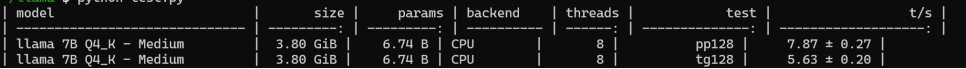
**图6 ./llama-bench -m llama2-7b-q4_k_m.gguf -p 128 -n 128 -t 8**
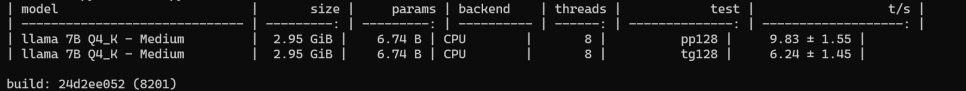
**图7 ./llama-bench-monarch -m llama2-7b-monarch.gguf -p 128 -n 128 -t 8
可以看到，token速度从8/s提升到了10/s左右**


### 8.2 APP 可视化部署

进一步地，方案尝试将模型部署为 Android APP，用于展示端侧推理效果。APP 中可加载：

* 原始 Q4_K_M 模型；
* Monarch 优化后的模型。

在 APP 中可以展示：

* Prefill 速度；
* Decode 速度；
* Prompt 输入；
* 生成结果；
* 模型初始化状态。

早期 APP 测试中，Monarch 模型在 Decode 阶段相对原始模型具有更高速度，但相比 adb/Termux 测试，加速比有所下降，可能原因是 APP 端没有充分利用底层优化或存在额外 UI/调用开销。


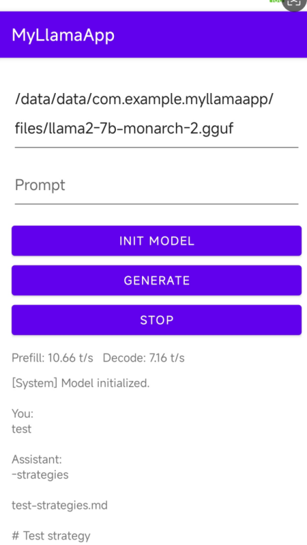
**图8 Android APP 对比截图：Monarch**
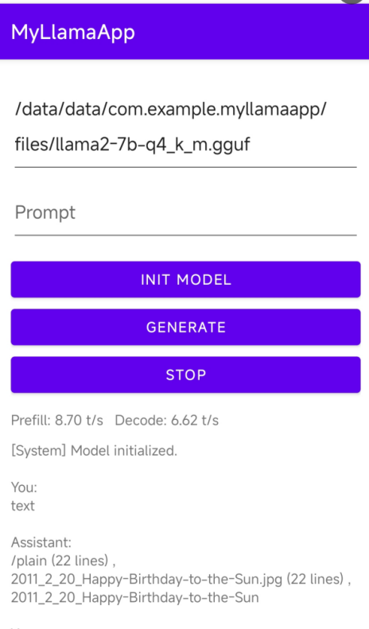
**图9 Android APP 对比截图：baseline**


---

## 9. 实验结果汇总

### 9.1 llama.cpp perf 测试

在不进行量化的情况下，使用 llama.cpp 自带 `--perf` 测试原始模型、SVD 计算模型和 Monarch 稀疏化模型：

| Method  |              Eval time | ms/token | tokens/s |
| ------- | ---------------------: | -------: | -------: |
| Base    | 37218.30 ms / 255 runs |   145.95 |     6.85 |
| SVD     | 38398.69 ms / 255 runs |   150.58 |     6.64 |
| Monarch | 34556.82 ms / 255 runs |   135.52 |     7.38 |

可以看到，SVD 在实际执行中反而慢于 base，说明理论低秩收益没有兑现；Monarch 则实现了更好的 latency。

### 9.2 Dense / SVD / Monarch 对比

| Method  | Compression Ratio | PPL Drop | Intermediate Tensor Size | Latency ms/token | Speedup |
| ------- | ----------------: | -------: | -----------------------: | ---------------: | ------: |
| Dense   |                 - |        - |                        - |           141.02 |       - |
| SVD     |             2.31× |     0.58 |                       29 |           132.18 |   1.07× |
| Monarch |             2.25× |     0.33 |                       12 |           102.36 |   1.38× |

从结果可以看出，SVD 虽然压缩率略高，但中间张量更大，实际 latency 收益较弱；Monarch 在压缩率相近的情况下，PPL drop 更低，中间张量更少，推理速度更快。

### 9.3 Memory Traffic 对比

| Method  | DRAM Read MB/token | DRAM Write MB/token | Total Memory Traffic | Latency ms/token | Speedup |
| ------- | -----------------: | ------------------: | -------------------: | ---------------: | ------: |
| Dense   |             180.33 |               31.25 |               210.84 |           141.02 |       - |
| SVD     |             181.48 |               34.25 |               258.81 |           132.18 |   1.07× |
| Monarch |             162.48 |               34.19 |               186.42 |           102.36 |   1.38× |

该结果说明，SVD 的额外中间读写会增加总 memory traffic；Monarch 则通过结构化 block 和更好的数据流减少总访存量，因此更适合移动端。

### 9.4 llama-2-7B 精度测试

| Method                        | WikiText-2 PPL | MMLU Acc. 1000 samples |
| ----------------------------- | -------------: | ---------------------: |
| Baseline INT8 Quantized       |           8.32 |                   55.2 |
| Baseline INT4 Quantized       |          17.64 |                   48.1 |
| Monarch block=32 full         |          17.87 |                   47.5 |
| Monarch block=32 保留 75% block |          18.23 |                   43.6 |
| Monarch block=64 full         |          17.92 |                   47.8 |
| Monarch block=64 保留 75% block |          18.09 |                   45.8 |

结果说明，Monarch 与 INT4 baseline 的精度接近，同时可以通过结构优化带来更高实际推理速度。对于 block pruning，需要进一步优化重要性评估策略，避免过度删除导致 MMLU 明显下降。

---

## 10. 当前支持范围与后续规划

### 10.1 当前进展

当前方案已经完成：

1. 从 SVD 低秩分解向 Monarch 结构化分解的算法路线切换；
2. 完成 Monarch 在 llama.cpp / GGML 中的自定义算子支持；
3. 支持 llama-2-7B 的手机端测试；
4. 实现 Q4_K_M 量化模型上的 Monarch 替换与推理；
5. 通过 Termux / adb / APP 完成初步端侧部署验证；
6. 扩展到 Qwen-2.5 系列模型，并实现一定实际加速。

> 【建议插图 13】插入 Qwen-2.5-7B 端侧 demo 截图，例如带有 “2.39× speedup” 的展示图。

### 10.2 正在推进的方向

后续工作包括：

1. **支持更多模型架构**
   进一步支持 Qwen-3、Qwen-3.5、Qwen3-VL 等系列模型，例如：

   * Qwen-3-0.6B；
   * Qwen-3.5-0.8B；
   * Qwen3-VL-2B；
   * Qwen3-VL-4B。

2. **更细粒度的精度控制**
   当前仍主要依赖 llama.cpp 现有量化 kernel，例如 Q4_K_M。后续需要根据 Monarch 分解后的 block 特性，支持 layer-wise 甚至 block-wise mixed precision。

3. **更稳定的解码速度**
   当前转换后的模型解码速度存在一定波动，可能与 block 稀疏导致的计算量不稳定有关。后续需要进一步优化 block 调度、bitmap 表示和 kernel 内部执行路径。

4. **APP 端完整优化**
   APP 端加速比低于 adb/Termux 测试，需要进一步排查 JNI 调用、线程绑定、动态库编译、CPU affinity、内存分配和模型加载路径等因素。

5. **内存收益量化**
   后续需要进一步 profile 当前进程内存占用、CPU_REPACK 开销、DRAM read/write traffic，从而更系统地证明 Monarch 在移动端的访存优势。

6. **扩展到云端芯片场景**
   移动端主要瓶颈在 decode 和访存，而云端芯片可能更关注 prefill 阶段。后续可以研究 Monarch 在 prefill-heavy 场景中的适用性。

---

## 11. 总体技术路线总结

整个方案的演进过程可以总结为：

```text
VLM/MoE 极低比特压缩
        ↓
CESD + GLAS + NGES
        ↓
单聚合 → Layer-wise 聚合 → Block-wise 聚合
        ↓
尝试 SVD 低秩分解并部署到手机端
        ↓
发现 SVD 在移动端存在 rank 不稳定、kernel 不友好、中间访存大的问题
        ↓
转向 Monarch 结构化矩阵分解
        ↓
Arch-aware block size 选择
        ↓
FlashMonarch 数据流优化
        ↓
Block sparse + bitmap 选择性执行
        ↓
修改 llama.cpp / GGML，新增 Monarch 自定义算子
        ↓
完成 Termux / adb / Android APP 端侧测试
```

最终，方案的核心价值在于：不是单纯追求理论 FLOPs 下降，而是从移动端真实执行特性出发，将权重矩阵重构为更适合端侧 kernel、cache、访存层次和固定执行粒度的结构，从而提升实际推理速度。

---

## 12. 可以插入图片的位置汇总

1. **背景部分**
   插入 Qwen3-VL 模型结构图，说明压缩对象是 Transformer/MoE，而非 vision encoder。

2. **早期方法部分**
   插入 CESD + GLAS + NGES 总体框架图，说明早期二值化方案。

3. **相似度分析部分**
   插入 text-layer、vision-layer、overall model 的 Frobenius 相似度热力图。

4. **Block-wise 聚合部分**
   插入 row-wise tensor block 划分图，以及 block-wise CESD / GLAS 公式图。

5. **SVD 到 Monarch 转换部分**
   插入 SVD 分解公式图和 Monarch (M = PLPR) 结构图，形成对比。

6. **Permutation 解释部分**
   插入 reshape-transpose-reshape 的 permutation 示意图，说明 (P^2=I)。

7. **FlashMonarch 部分**
   插入标准 Monarch 显式 permutation 与 FlashMonarch 隐式 layout permutation 的对比图。

8. **GGML 实现部分**
   插入 `GGML_OP_MONARCH_BDIAG` 或 `ggml_compute_forward_monarch_bdiag` 的代码截图。

9. **手机端 benchmark 部分**
   插入 llama-bench 原始 Q4_K_M 与 Monarch 模型的终端速度对比截图。

10. **APP 展示部分**
    插入 Android APP 左右对比图，展示 baseline 和 Monarch 的 prefill/decode 速度。

11. **最终 demo 部分**
    插入 Qwen-2.5-7B 或其他模型的手机端 demo 截图，突出实际 speedup。

---

## 13. 一句话总结

本方案从最初的 MoE/VLM 极低比特压缩出发，经过 SVD 低秩分解尝试后，发现传统低秩方法难以适配移动端推理框架和访存特性，因此转向 Monarch 结构化矩阵分解，并进一步结合 FlashMonarch 数据流、block sparse 机制和 llama.cpp/GGML 自定义算子，实现了从算法设计到手机端实际部署测试的完整闭环。
